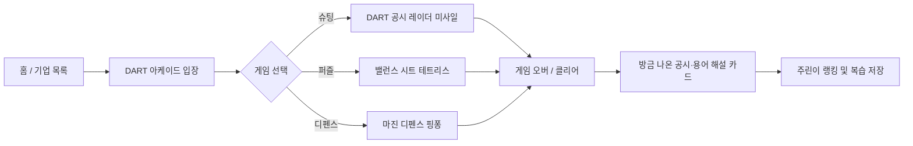

# 🕹️ Easy-DART 게이미피케이션 기획서 (Gamification Master Plan)

> **문서 버전:** v1.0  
> **담당자:** 팀원 C (은경 / `Eunkyung` 브랜치)  
> **타겟 사용자:** 2030 주린이(초보 투자자), DART 공시 및 재무제표가 낯선 입문자  
> **핵심 컨셉:** "단순한 텍스트 퀴즈는 그만! 클래식 아케이드 게임으로 온몸으로 체득하는 금융 공시·재무제표"

---

## 1. 기획 배경 및 목적

### 1.1 배경 및 문제의식
- **DART 공시의 높은 진입장벽**: 전자공시시스템(DART)은 전문 회계·법률 용어로 가득 차 있어 초보 투자자가 스스로 읽고 위험을 감지하기 매우 어렵습니다.
- **기존 텍스트 퀴즈의 한계**: 기존 4지선다 객관식 퀴즈는 단순 암기형에 그쳐 사용자의 흥미 유발과 지속적인 학습 동기 부여에 한계가 있습니다.
- **손끝으로 배우는 체감형 학습 필요**: 블록을 맞추고, 날아오는 미사일을 쏘고, 공을 튕겨내는 **클래식 아케이드 게임 메커니즘**을 금융 개념과 1:1로 결합하여 직관적인 손맛과 학습 효과를 동시에 제공합니다.

### 1.2 목표 (Objectives)
1. **용어 공포증 극복**: '감사의견', '자본잠식', '영업이익' 등의 핵심 개념을 게임 규칙으로 체화.
2. **위험 회피 능력 배양**: 상장폐지 리스크(의견거절, 횡령, 과도한 부채)를 본능적으로 피하고 걸러내는 직관 훈련.
3. **높은 재방문율 및 몰입도**: 가볍고 중독성 있는 미니게임을 통해 플랫폼 체류 시간 증대.

---

## 2. 사용자 여정 (User Journey)



1. **아케이드 진입**: 메인 화면 네비게이션 또는 기업 상세 페이지의 "실전 훈련 아케이드"를 통해 진입.
2. **미니게임 플레이**: 60초~2분 내외의 속도감 있는 아케이드 플레이.
3. **즉각적인 금융 피드백**: 게임 중 등장했던 호재/악재 공시 및 회계 용어에 대한 친절한 해설 팝업 노출.
4. **학습 성취감**: 점수에 따른 칭호 부여 (예: '동전주 감별사' ➡️ '스마트 머니' ➡️ '공시 마스터').

---

## 3. 상세 게임 3종 기획안

### 🎮 Game 1: DART 공시 레이더 미사일 (DART Radar Shooter)
> **"기업을 위협하는 치명적 악재 공시를 조준 격추하라!"**

* **장르**: 종스크롤 아케이드 슈팅 (갤러그 / 스페이스 인베이더 스타일)
* **조작법**: 좌우 방향키(또는 모바일 터치/드래그), 스페이스바(미사일 발사)
* **게임 룰**:
  - 화면 상단에서 다양한 '공시 캡슐'이 레이더망을 향해 내려옵니다.
  - **격추 타겟 (악재 공시)**: 요격 시 💥 폭발 이펙트와 함께 점수 획득.
    - `[감사의견 거절]`, `[완전자본잠식]`, `[횡령·배임 혐의]`, `[부채비율 900%]`, `[전환사채(CB) 대량 발행]`
    - 성공 메시지: *"상장폐지 위험 격추 성공! (+100점)"*
  - **격추 금지 (호재 공시)**: 오인 사격 시 경고음과 함께 방어막(기업 시총) 감소.
    - `[적정 의견]`, `[영업이익 흑자전환]`, `[대규모 신규 수주]`, `[주당 배당금 상향]`
    - 감점 메시지: *"앗! 우량 공시를 쐈습니다! (-50점)"*
* **핵심 학습 효과**: 주식 계좌를 파멸로 이끄는 5대 지뢰 공시를 0.5초 만에 눈으로 식별하는 반사신경 훈련.

---

### 🎮 Game 2: 밸런스 시트 테트리스 (Balance Sheet Tetris)
> **"자산 = 부채 + 자본! 블록의 균형을 맞춰 무너지지 않는 재무구조를 구축하라!"**

* **장르**: 낙하형 퍼즐 (테트리스 스타일)
* **조작법**: 좌우 이동, 블록 회전, 급하강(하드 드롭)
* **게임 룰**:
  - 상단에서 3가지 성격의 회계 블록이 떨어집니다.
    - 🟦 **자산 블록 (Asset)**: 파란색 블록 (현금, 공장, 특허권 등)
    - 🟥 **부채 블록 (Liability)**: 빨간색 가시 블록 (단기차입금, 외상값 등)
    - 🟩 **자본 블록 (Equity)**: 초록색 안정 블록 (납입자본금, 이익잉여금 등)
  - **회계 항등식 라인 클리어**: 자산 블록과 (부채 + 자본) 블록이 수평 라인에서 균형을 이루면 라인이 지워지며 재무 건전성 점수 획득.
  - **부채 과다 페널티**: 빨간색 부채 블록이 과도하게 쌓이면 블록 낙하 속도가 빨라지며 '워크아웃 경보' 발령.
  - **영업흑자 찬스**: 가끔 등장하는 '순이익 황금 블록'으로 부채 블록 라인을 한 번에 청산 가능.
* **핵심 학습 효과**: 회계의 대원칙인 **[자산 = 부채 + 자본]**과 무리한 차입 경영의 위험성을 퍼즐로 자연스럽게 이해.

---

### 🎮 Game 3: 마진 디펜스 핑퐁 (Margin Defense Pong)
> **"치솟는 비용을 튕겨내고 영업이익 마진을 수호하라!"**

* **장르**: 패들 바운스 & 벽돌깨기 (알카노이드 / 핑퐁)
* **조작법**: 패들 좌우 이동
* **게임 룰**:
  - 플레이어는 하단의 **'영업이익 방패(패들)'**를 조작합니다.
  - 상단에는 20대 친숙 기업들의 핵심 상품 블록이 배치되어 있습니다. (올리브영 독도토너, 다이소 생활용품, 스타벅스 아메리카노 등)
  - 공(투자 자본/판매 흐름)을 튕겨 상단 상품을 맞추면 **매출액(Revenue)**이 적립됩니다.
  - 날아오는 방해 탄환(원자재 가격 폭등, 상가 임대료 인상, 판관비 급증)을 패들로 방어해야 합니다.
  - 공을 바닥으로 떨어뜨리면 **영업손실(적자)**이 발생하며 게임 종료.
* **핵심 학습 효과**: 기업은 물건을 많이 파는 것(매출)도 중요하지만, 비용을 제대로 통제해야 비로소 순이익이 남는다는 손익계산서 메커니즘 체감.

---

## 4. 기술 아키텍처 및 구현 스택

```
Easy-DART Frontend (src/)
├── pages/
│   ├── quiz_terms/             # 기존 퀴즈 화면
│   └── game_arcade/            # [NEW] 핑거다트 게임 아케이드 메인
│       ├── index.html          # 오락실 로비 & 게임 선택
│       ├── style.css           # 아케이드 네온/레트로 테마 스타일
│       ├── arcade_manager.js   # 게임 공통 관리자 (스코어, 사운드, 오답노트)
│       └── games/
│           ├── radar_shooter.js # [Game 1] DART 미사일 슈팅 엔진
│           ├── bs_tetris.js     # [Game 2] 밸런스 시트 테트리스 엔진
│           └── margin_pong.js   # [Game 3] 마진 디펜스 핑퐁 엔진
└── styles/
    └── common.css              # 공통 컬러/토큰
```

### 4.1 기술 스택 선정 이유
- **HTML5 `<canvas>` + Vanilla JavaScript**:
  - 무거운 외부 라이브러리(Phaser, Three.js 등) 설치 없이 웹 브라우저 자체 API만으로 초경량 60fps 구동.
  - 로딩 시간 0.1초 미만, 모바일/데스크톱 모두에서 부드러운 반응성 보장.
- **FastAPI 백엔드 연동 (`backend/app/api/quiz.py`)**:
  - `GET /api/game/keywords`: 게임에 사용할 최신 호재/악재 공시 및 재무 데이터 제공.
  - `POST /api/game/score`: 사용자 점수 기록, 획득 뱃지 계산 및 맞춤형 복습 피드백 반환.

---

## 5. 단계별 개발 로드맵 (Milestones)

| 단계 | 목표 | 주요 작업 내용 | 예상 산출물 |
| :--- | :--- | :--- | :--- |
| **Phase 1** | **슈팅 게임 프로토타입** | • DART 레이더 미사일 슈팅 캔버스 구현<br>• 악재/호재 공시 판별 로직 및 파티클 이펙트<br>• 게임 종료 후 공시 해설 팝업 | `radar_shooter.js`, 단독 테스트 페이지 |
| **Phase 2** | **아케이드 허브 구축** | • 게임 선택 로비(오락실 테마 UI) 제작<br>• 핑퐁 / 테트리스 모듈 순차 개발<br>• 사운드 FX 및 모바일 터치 컨트롤 지원 | `pages/game_arcade/index.html` |
| **Phase 3** | **백엔드 연동 & 완성** | • 백엔드 API 라우터 확장 (`api/quiz.py`)<br>• 게임 결과 점수 저장 및 주린이 레벨 뱃지 시스템<br>• 기존 기업 상세 페이지(`company_detail`)와 연결 | 배포 및 팀원 통합 테스트 |

---

## 6. 기대 효과

1. **학습 몰입도 극대화**: "공시 읽기는 지루하다"는 고정관념을 깨고 손맛 있는 경험 선사.
2. **차별화된 포트폴리오**: 단순 CRUD 웹서비스를 넘어 캔버스 기반 인터랙티브 게임과 금융 도메인을 결합한 독보적인 기능 완성.
3. **팀 프로젝트 시너지**: 팀원 A(DART 데이터 수집), 팀원 B(기업 상세 UI)의 데이터와 완벽히 상호보완되는 엔터테인먼트 허브 역할 수행.
